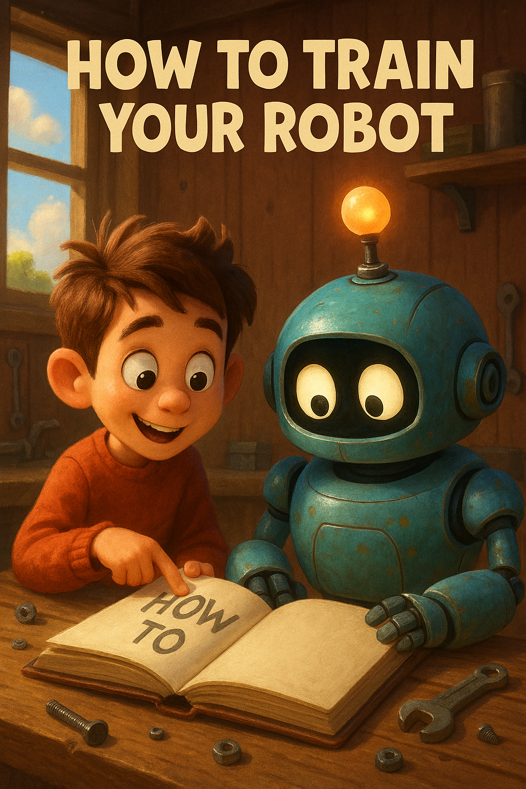

# How to train a robot 101?

# This is my first time coding anything.

Code is like a special language that computers use to talk and understand. It's a set of very specific instructions that tell a computer exactly what to do. You can think of it like a recipe in a cookbook, a manual for building with LEGOs, or the sheet music a musician follows. Unlike other instructions, the code for computers has to be extremely precise with no ambiguity.

<a href="https://www.youtube.com/watch?v=FN2RM-CHkuI&t=106s">How to make a peanut butter sandwich</a>

<a href="02-java-print.md">First Lesson</a>