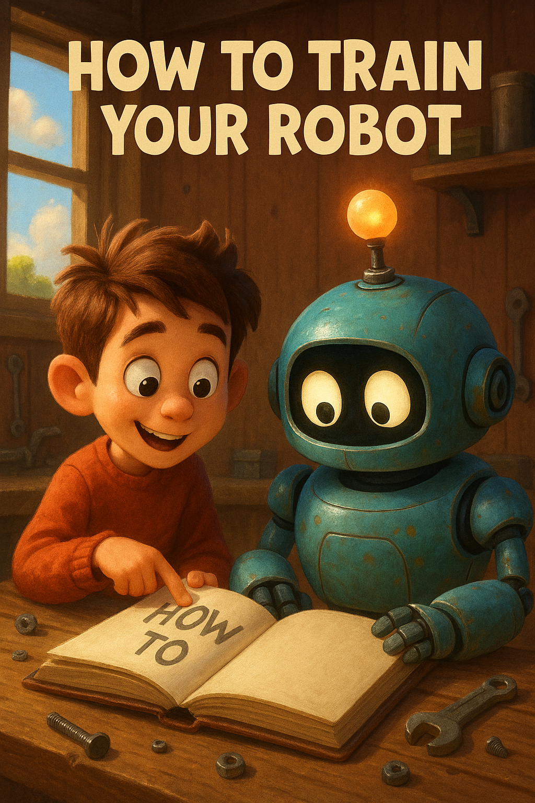

# How to train a robot 101?



# This is my first time coding anything.

Code is like a special language that computers use to talk and understand. It's a set of very specific instructions that tell a computer exactly what to do. You can think of it like a recipe in a cookbook, a manual for building with LEGOs, or the sheet music a musician follows. Unlike other instructions, the code for computers has to be extremely precise with no ambiguity.


[](https://www.youtube.com/watch?v=FN2RM-CHkuI&t=106s)


Your First Line of Code

Let's start. In Robotics, we use a language called Java to communicate with robots. Here’s a simple example of what Java code looks like:

```java
public class Hello {
    public static void main(String[] args) {
        System.out.println("Hello, world!");
    }
}
```
<div class="collapse">
    <details>
        <summary>Output</summary>
        <pre class="output">Hello, world!</pre>
    </details>
</div>


In this code, we are asking the computer to print out (display) the words "Hello, world!" on the screen.

public class Hello {
    public static void main(String[] args) {
        System.out.println("Hello, I am a goofy goose!");
    }
}
<div class="collapse">
    <details>
        <summary>Output</summary>
        <pre class="output">Hello, I am a goofy goose!</pre>
    </details>
</div>


Yes! We just printed a different message on the screen. Now, it's time to understand how the program works. Let’s do this by looking at each line of the code.

You might not understand everything about the code in this first lesson, and that's perfectly okay. As you go through more lessons, it will all start to make sense. Learning how to code just like any other skill takes time and practice. However, after this lesson, you'll have enough understanding to start writing and figuring out some simple programs.

## Let’s try to understand the parts of our first program:

### class Hello
<!-- rewrite -->
This is the class definition (you will learn more about this later). For now, just keep in mind that we need to have a class in our code and we write like this. Hello is the name of the class. We can give any other name of the class like FirstProgram, Robot, etc. 

The curly braces { } following class Hello represent the body of the class. All the statements written inside these curly braces are inside the body of the class named Hello.

<!-- HERE THERE SHOULD BE SOME IMAGES -->


### public static void main(String[] args)
<!-- rewrite -->
This is the main method (you will learn about methods/functions later). Its significance is that whenever we run our code, the main method gets executed first. It means that the code written inside this is executed first when a Java program is run.


Similar to a class, the curly braces { } following public static void main(String[] args) represent the body of the main method.

<!-- HERE THERE SHOULD BE SOME IMAGES -->


### System.out.print("Hello World");
<!-- rewrite -->
This is the statement which printed the message on the screen. The semicolon ; at the end marks the end of the statement. We end our statements with a semicolon in Java. print() is a method which basically printed the message "Hello World". print() method is available in the System directory. It is used to display something on the screen.


<!-- HERE THERE SHOULD BE SOME IMAGES -->

Thus, the format of a Java program is as shown below.

```java
class CLASSNAME{

  public static void main(String[] args){
    Statement
    Statement
    Statement
    ....
  }
}
```


The body of the class contains the main method, and the body of the main method contains statements.

In the first example, you can see that the main method is inside the class Hello and the statement System.out.print("Hello World"); is inside the main method.


<!-- HERE THERE SHOULD BE SOME IMAGES -->

As mentioned earlier, when we run a program, the main method (hence the statements inside the main method) gets executed first.


## Exercise
Try to print out "Hello" and your name. 


<!-- ADD SOMETHING HERE -->

## Printing in Java

We have already seen how to print something on screen. Let’s again look at the first example given in this chapter.

```java
public class HelloWorld {
    public static void main(String[] args) {
        System.out.println("Hello, world!");
    }
}
```
<div class="collapse">
    <details>
        <summary>Output</summary>
        <pre class="output">Hello, world!</pre>
    </details>
</div>

This program prints Hello World. Thus, to print any message, we write it within double quotes " " inside System.out.print().

<!-- HERE THERE SHOULD BE SOME IMAGES -->


Look at another example.

```java
public class Hello {
    public static void main(String[] args) {
        System.out.print("Hello");
        System.out.print("I am a goofy goose!");
    }
}
```

<div class="collapse">
    <details>
        <summary>Output</summary>
        <pre class="output">HelloI am a goofy goose!</pre>
    </details>
</div>

Here the first statement prints Hello and the second statement prints I am a goofy goose!


Now let’s print a number.

```java
public class Hello {
    public static void main(String[] args) {
        System.out.println(123);
    }
}
```
<div class="collapse">
    <details>
        <summary>Output</summary>
        <pre class="output">123</pre>
    </details>
</div>

or there is another way to print a number.

```java
public class Hello {
    public static void main(String[] args) {
        System.out.println("123");
    }
}
```
<div class="collapse">
    <details>
        <summary>Output</summary>
        <pre class="output">123</pre>
    </details>
</div>

Now suppose we want to print Hello and World in different lines. For that, we can use the println() method instead of the print() method as shown below.

```java
public class Hello {
    public static void main(String[] args) {
        System.out.println("Hello");
        System.out.print("World");
    }
}
```

<div class="collapse">
    <details>
        <summary>Output</summary>
        <pre class="output">Hello
World</pre> 
    </details>
</div>

The println() method changes the line after printing its content.

In the above example, System.out.println("Hello") printed Hello and then moved to a new line. After that, System.out.print("World") printed World.


## Joining Strings while Printing
We can also join two strings while printing. For example, if we want to print Hello World, we can write it like this.

```java
public class Hello {
    public static void main(String[] args) {
        System.out.println("Hello" + "World");
    }
}
```
<div class="collapse">
    <details>
        <summary>Output</summary>
        <pre class="output">HelloWorld</pre>
    </details>
</div>


<!-- USING SPECIAL CHARACTERS -->


## Java Basics
Now that you know how to print anything on screen, let’s look at some basics of Java.


## Whitespace

Whitespace refers to spaces, tabs and newlines. In some places in our code, whitespace is necessary, whereas in other places, it is given just to improve readability.

For example, while writing `class Hello``, it is necessary to give a space between class and Hello (as they are two different words).

`class Hello`

On the contrary, there is no need to give any space or newline in the following program after `{`.

`class Hello{public static void main(String[] args){System.out.print("Hello World");}}`

```java
class Hello{public static void main(String[] args){System.out.print("Hello World");}}
```

<div class="collapse">
    <details>
        <summary>Output</summary>
        <pre class="output">Hello World</pre>
    </details>
</div>


Although we can give as many whitespaces as we want, the compiler ignores all the unnecessary whitespaces. The following code also runs just fine.

```java
class    Hello{
	
  public	static		void main(String[] args)   {
    		System.out.print("Hello World");
    		
    		
  }
}
```

<div class="collapse">
    <details>
        <summary>Output</summary>
        <pre class="output">Hello World</pre>
    </details>
</div>

## Indentation

Indentation is a set of whitespaces at the beginning of the lines of code inside the body of a class, method, etc. It makes our code more readable. It is not compulsory to give indentation in a program in Java but giving it is a good practice.

To understand the need of indentation, look at the following two programs.


```java
class Hello {

    public static void main(String[] args) {
        System.out.println("Hello World");
    }
}
```


```java
class Hello {
public static void main(String[] args) {
System.out.println("Hello World");
}
}
```


Which one of the above two programs do you think is more readable? Correct, it is the first one.

In the first program, we gave indentation before the code (main method) inside the body of the Hello class. We also gave indentation before the code (System.out.println statement) inside the body of the main method. Giving indentation made the code more neat and clean. This is the significance of indentation.

It is preferred to give 2 or 4 spaces in indentation. It can also be given by tabs equivalent to 2 or 4 spaces. Indentation should be consistent throughout the program, which means that if an indentation of 4 spaces is given at one part of the program, then the same indentation should be given at other parts of the program.

A good programmer always indents the code. So, make it a habit of adding indentation to your code right from the start.


## Comments
Comment is some text written in a program and ignored by the compiler while compiling the code. Comments are for humans to read and not for computers. These are written to make our code more readable.

Single Line Comments
Single line comments always start with `//`. The next line is not a part of the comment.

```java
// This is a single line comment
public class Hello {
    public static void main(String[] args) {
        System.out.println("Hello World");
    }
}
```

<div class="collapse">
    <details>
        <summary>Output</summary>
        <pre class="output">Hello World</pre>
    </details>
</div>

Multiline Comments
We can also write comments which extend upto multiple lines. Multiline comments are written within `/* */`.

```java
/* This is a
multiline comment
   which extends upto multiple lines */
    
public class Hello {
    public static void main(String[] args) {
        System.out.println("Hello World");
    }
}
```

Note that we can't put one comment inside another.For example, /* This is a /*comment*/ */ is invalid.

Why to use Comments?
As mentioned earlier, it makes your code more understandable. Assume that you have written a software and after releasing it, you hired a few good programmers for its maintenance. Without comments, it would be a very difficult job for them to understand your code. And most of the time it happens that the person who has written a code is not the one who is going to modify it. So, make a habit of writing good comments.

It is also not recommended to write too many comments. A clean and good code can be understood without comments.


Java Keywords
There are few words which are used by Java itself. So, we can't use those words for the name of our classes, methods or variables (we will learn about variables in the next chapter) as they are reserved for Java. For example, the keyword class is used by Java to create a class and thus we can’t use it as the name of a class. Doing so will give us an error.

Here is the list of a few keywords reserved for Java.

<!-- make a table  -->

|    |     |       |       |
|------------|-------------|--------------|--------------|
| abstract   | assert      | boolean      | break        |
| byte       | case        | catch        | char         |
| class      | const       | continue     | default      |
| do         | double      | else         | enum         |
| extends    | final       | finally      | float        |
| for        | goto        | if           | implements   |
| imports    | instanceof  | long         | native       |
| new        | package     | private      | protected    |
| public     | return      | short        | static       |
| striptfp   | super       | switch       | synchronized |
| this       | throw       | throws       | transient    |
| try        | void        | volatile     | while        |


Wooh! This had a lot of terminologies but it was just to introduce you to the basics of Java. We will look at variables in somewhat more detail in the next chapter.


# Variables in Java

Till now, we know how to print anything on screen. Now, let’s learn about variables in Java which are somewhat similar to the variable we use in Mathematics.

What are Variables?
A variable is used to store some value. You can think of a variable as a storage which has a name and stores some value.

<!-- HERE THERE SHOULD BE SOME IMAGES -->

```java
class Test {

    public static void main(String[] args) {
        int n;
        n = 4;
        System.out.println(n);
    }
}
```

<div class="collapse">
    <details>
        <summary>Output</summary>
        <pre class="output">4</pre>
    </details>
</div>


In this example, n is a variable and we stored a value of 4 in it.

int n → This statement declares that n is a variable that can store some integer value (because int is written before n). Whenever a variable is declared, it takes some space in the memory of the computer. With this declaration, a space is allocated to n in the memory of the computer to store an integer value.


n = 4 → A value 4 is assigned to the variable n.

System.out.println(n) → The System.out.println() method prints the value of n on the screen.

Note that while printing, n is not written within double quotes " ". This is because n written within double quotes " " would have printed simple n instead of the value of n.

Look at another example.


